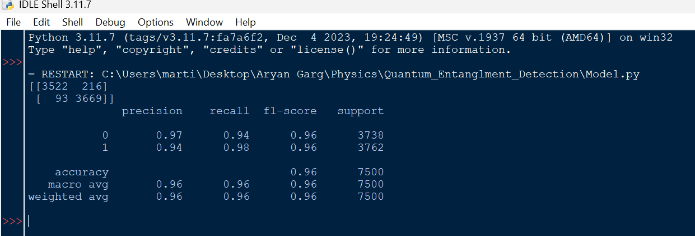

# Quantum Entanglement Detection in Bipartite Qutrit Systems using Machine Learning

## Overview  
This project develops a machine-learning framework for detecting quantum entanglement in bipartite qutrit (3 × 3) systems. Unlike qubit-based systems, qutrit states exist in a higher-dimensional Hilbert space, which makes entanglement detection more complex and demanding in terms of computation.  

Using graph-generated quantum states, this project shows that supervised machine-learning models can accurately classify quantum states as entangled or separable. The classification accuracies reach as high as 96%.  

---
## Results

**Gradient boosting** consistently performed better than other models, reaching classification accuracies of up to **96%** on held-out test data.

---
## Scientific Background  
Quantum entanglement is a key resource in quantum information science. It has applications in quantum communication, cryptography, and computation. Figuring out if a specific quantum state is entangled is usually a challenging task, particularly in higher-dimensional systems.  

For bipartite qutrit states, the **Positive Partial Transpose (PPT) criterion** offers a necessary and sufficient condition for separability in many situations. This makes it a helpful tool for classifying quantum states. However, using these criteria over and over can be costly in terms of computation for large datasets. This creates a need to explore data-driven approaches.  

---
## Dataset Construction
The dataset used in this project is generated using **random graph structures**, following a graph-theoretic approach to quantum state construction.

The procedure is as follows:
- Generate random graphs
- Extract adjacency matrices
- Convert adjacency matrices into **physically valid quantum density matrices**
- Enforce Hermiticity, positivity, and unit trace
- Label each state as **entangled or separable** using the PPT criterion

This approach produces a diverse set of valid bipartite qutrit states suitable for supervised learning.

---
## Methodology
- Represent each quantum state as a density matrix
- Compute the **partial transpose** of each state
- Use the PPT criterion to generate ground-truth labels
- Extract numerical features from density matrices
- Train and compare multiple supervised machine-learning models

Models evaluated include:
- Support Vector Machines (SVM)
- Random Forests
- Gradient Boosting classifiers

Model performance is assessed using standard classification metrics.

---
